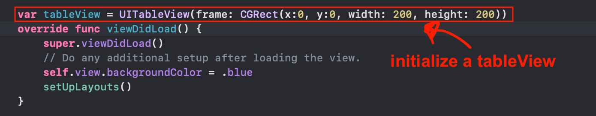

# Codepath Tech Fellow Training WEEK 7 (8/14)

In-class lab:

In this lab we build an app programmatically from scratch with out stroyboard and demonstrate UITableView.

Requirements: Xcode 11+ 

<!-- [Class recording link](https://www.youtube.com/watch?v=40gdqVyr9Hk&list=PLrT2tZ9JRrf5vvh-Xb86rnMuorl2us3zc&index=6)
 -->
## User Stories

0. Setting Things Up

1. Create a new iOS application project in Xcode and set up the project as usual, give a product name and interface should be Storyboard and then click Create! 

2. Delete Main.storyboard, then go to info.plist -> Application Scence Manifest -> Screen Configuration -> Application Session Role -> Item 0 (Default Config) -> Storyboard Name (DELETE THIS OR YOU WILL GET ERRORS DURING COMPILE TIME)

3. In PView.xcodeproj within General settings and Deployment Info delete the text "Main" from the Main Interface text bar or Xcode will search for the Main.storyboard when compilling.

1. Setting SceneDelegate.swift

The scene delegate will help set up the scenes of our app, as well as  their initial views.

1.  Here we set up the inital view controller in the scene(:willConnectTo) method found inside the SceneDelegate class

	- The scene(:willConnectTo:options:) delegate function is called when a new scene is added to the application. It will get provided a scene object along with a session. The UIWindowScene object is created by the app.
	- UIWindow is part of scene, so our window property is being used and initilized by scene.
	- A root view controller is assigned, the local window constant is assigned to the window property, and the window is “made key and visible,” (put the window at the front of the app’s UI).

3. Add and constraint a UITableView

1. First thing we do is we add a property called tableView to the class, with the specified frame.

2. We create a function called setUpTableView() to set up our table view and then call it from setUpLayouts(). 

	- We first add our tableView as a subView to our view controllers view property. This is important becasue next we will be constraining our tableView and before we constraint a UIView, we need to always add it as a subView first.
	- In order to constraint a UIView (which UITableView is a subclass of) you have to set translatesAutoresizingMaskIntoConstraints to false. This way Xcode knows not to use default constraints and to use the ones we give instead. 
	- We then set the top, left, right, and bottom constraints of the tableView and activate them. 

4. Creating Data for Table View

1. Table views will only manage the layout of the data. They will not manage the data itself. To do this we must provide the table with a data source object by implementing UITableViewDataSource.

	- UITableViewDataSource requires two data source methods: one to provide the number of rows in the table and one to provide a cell for each row.
	- "Dequeuing a cell optimizes performance because it returns a reusable cell, rather than displaying and removing each cell instance. Dequeuing ensures that table views perform well even when processing vast quantities of data."

5. Creating Each Table View Cell

Lastly, we need to specify how to create each cell for the table view. 
1. First initialize a tableView cell. 

2. Now give the cell constraints and activate them, just like we did for the tableView.

## Video Walkthrough

Here's a walkthrough of implemented user stories:

## Notes

- All scenes are embedded in a window. You want to create that window in a sceneDelegate

- One of the first function your code comes into is 'func scene()' to set up a scene

## Resources
[Scene Delegate vs. App Delegate Explained](https://learnappmaking.com/scene-delegate-app-delegate-xcode-11-ios-13/)

[Setting Up a Table View](https://martinlasek.medium.com/tutorial-adding-a-uitableview-programmatically-433cb17ae07d)

[Setting Up Data for Table View](https://developer.apple.com/tutorials/app-dev-training/setting-up-a-table-view)